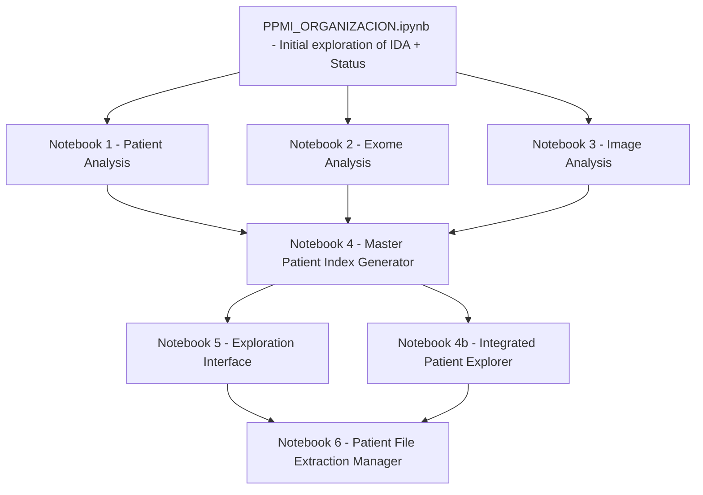
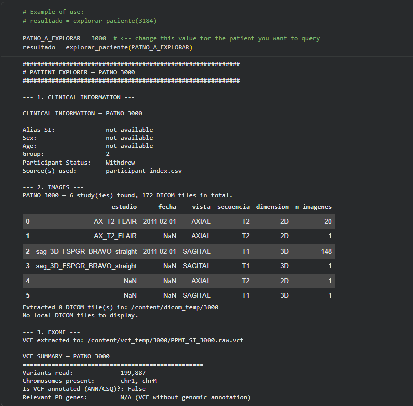
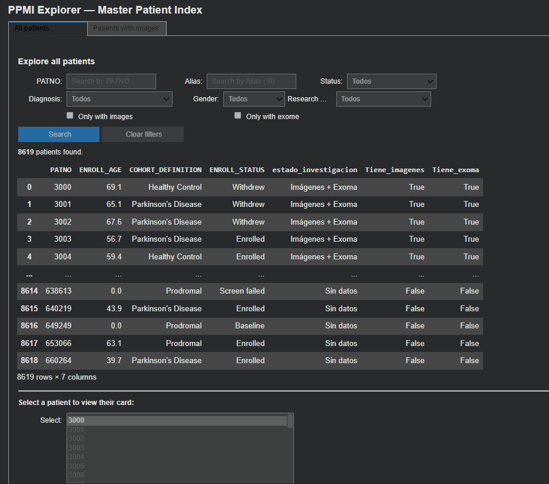
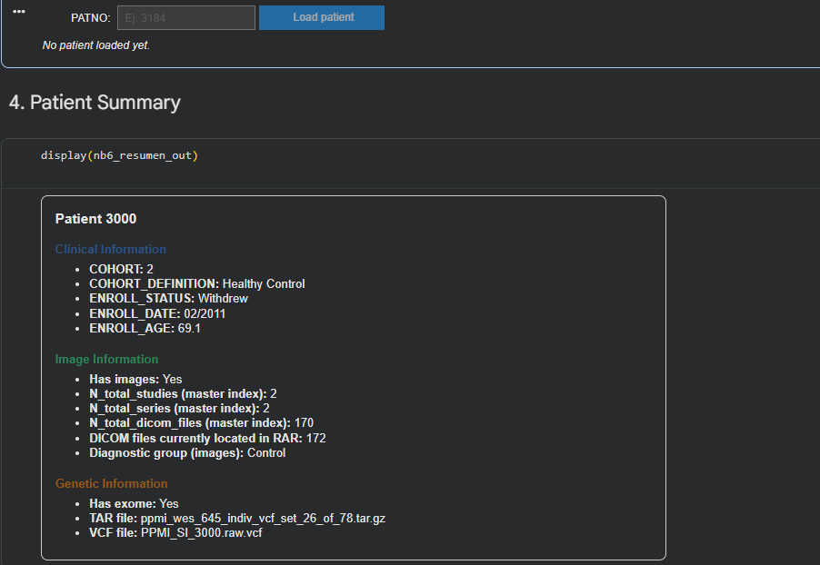
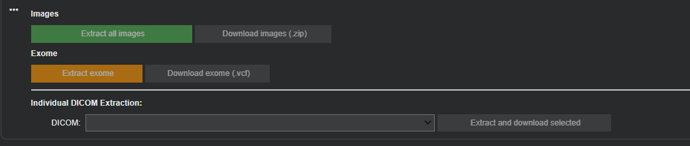

# PPMI_INVESTIGATION

Progress repository of the **Machine Learning and Deep Learning research seed group** at Universidad Autonoma de Manizales, focused on the analysis of data from the **Parkinson's Progression Markers Initiative (PPMI)**.

> Members: Jeyson Carmona, Michael Lamprea Vera, Melanny Cortez Zuniga

---

## About the data source: PPMI and the IDA platform

The [Parkinson's Progression Markers Initiative (PPMI)](https://www.ppmi-info.org/) is a public-private study funded by the Michael J. Fox Foundation for Parkinson's Research, aimed at identifying biomarkers of Parkinson's disease progression. It combines clinical-behavioral assessments, biospecimen assays, genetic data, and neuroimaging from thousands of participants (patients and healthy controls).

PPMI data is distributed through the LONI Image and Data Archive (IDA), a secure archiving system managed by the Laboratory of Neuro Imaging at the University of Southern California. IDA provides an interactive environment for storing, searching, updating, sorting, accessing, tracking, and manipulating neuroimaging and related clinical data, while restricting access to authorized users. Access requires signing a data use agreement and requesting authorization directly on the platform (https://ida.loni.usc.edu/).

Because of the size of the data and the terms of the data use agreement, raw files (imaging RARs, exome TARs) are **not versioned in this repository**. They must be downloaded by each user from their own authorized IDA account and placed in Google Drive following the folder structure described below.

---

## Objective

Build a reproducible pipeline that organizes and cross-references the three data sources provided by PPMI/IDA for each patient:

- **Clinical data** (`Participant_Status.csv`, questionnaires and assessments)
- **Medical images** (MRI/imaging studies, packaged as a large `.rar` file)
- **Whole exome sequencing data (WES)** (per-patient `.tar.gz` files)

The result is a **master patient index** (`paciente_master_index.csv`) and a set of interactive interfaces (in Colab, via `ipywidgets`) to explore and extract that information without having to manually decompress hundreds of gigabytes of data.

> All development is carried out in **Google Colab**, so the tables, widgets, and interfaces generated **do not render when viewing the `.ipynb` files directly on GitHub**. This README documents what each notebook does and serves as a visual reference (see [Interface Screenshots](#interface-screenshots)).

---

## Pipeline architecture



Core idea: notebooks 2 and 3 never decompress the large files. They only read the internal index (`tarfile.getmembers()` for the exomes, `unrar lb -r` for the images) and produce lightweight CSVs with the paths. Only Notebook 6 extracts specific files, on demand, for a given patient.

---

## Notebooks

| # | Notebook | Objective | Main inputs | Main output |
|---|----------|-----------|--------------|--------------|
| 0 | [`PPMI_ORGANIZACION.ipynb`](./PPMI_ORGANIZACION.ipynb) | Initial exploration of the IDA (imaging) and Participant Status datasets, validation of the common identifier (Subject ID / PATNO) | Raw IDA and Status CSVs | General diagnostic of the datasets |
| 1 | [`notebook1_patient_analysis.ipynb`](./notebook1_patient_analysis.ipynb) | Analyze Participant_Status.csv and Pacientes.csv: counts per cohort, enrollment status, duplicates | Participant_Status.csv | participant_index.csv |
| 2 | [`notebook2_exomas_analysis.ipynb`](./notebook2_exomas_analysis.ipynb) | Index the 78 exome .tar.gz files by reading their internal structure without decompressing | .tar.gz files (Drive) | exomas_index.csv |
| 3 | [`notebook3_images_analysis.ipynb`](./notebook3_images_analysis.ipynb) | Index the imaging .rar file (about 183 GB compressed, over 3M files) by reading only the header | Imagenes_PPMI.rar (Drive) | imagenes_index.csv |
| 4 | [`notebook4_Master_Patient_Index_Generator.ipynb`](./notebook4_Master_Patient_Index_Generator.ipynb) | Merge the three indexes above into a single per-patient index | participant_index.csv, imagenes_index.csv, exomas_index.csv | paciente_master_index.csv |
| 4b | [`notebook4_integrated_Patient_Explorer.ipynb`](./notebook4_integrated_Patient_Explorer.ipynb) | Given a PATNO, show in one place its clinical info and imaging study summary, with on-demand extraction | paciente_master_index.csv | Consolidated per-patient view |
| 5 | [`notebook5_Exploration_Interface_(1).ipynb`](<./notebook5_Exploration_Interface_(1).ipynb>) | Graphical interface (ipywidgets) to interactively explore paciente_master_index.csv (filters, search) | paciente_master_index.csv | Visual exploration, no file extraction |
| 6 | [`Notebook6_Patient_File_Extraction_Manager.ipynb`](./Notebook6_Patient_File_Extraction_Manager.ipynb) | Given a PATNO, selectively extract its clinical, imaging, and exome files | Indexes from notebooks 1-4 plus rutas_dicom_completas.csv | Extracted files for the selected patient |

Note on naming: the notebooks "Notebook 4" (Master_Patient_Index_Generator) and "notebook4_integrated_Patient_Explorer" share the same number but are different steps of the pipeline (index generation vs. per-patient exploration). They are listed as 4 and 4b in the table to reflect the actual execution order; the files can be renamed if a consistent numbering is preferred.

Each notebook includes an "Open in Colab" button in its first cell so it can be run directly.

---

## Google Drive folder structure

All notebooks read and write data from a shared Google Drive folder. **The paths below are hardcoded near the top of each notebook (variables such as `BASE_DIR`, `RAR_IMAGENES`, `DIR_EXOMAS`, `RESULTADOS_DIR`) and must be adjusted in the code if your own Drive layout is different.**

```
Investigacion_Parkinson/                          <- BASE_DIR
├── Imagenes/
│   └── Imagenes_PPMI.rar                          <- RAR_IMAGENES (raw, downloaded from IDA)
├── Exomas - Parkinson/
│   └── *.tar.gz                                   <- DIR_EXOMAS / EXOMAS_DIR (78 files, raw, downloaded from IDA)
├── Conteo pacientes/                               <- DIR_CONTEO (auxiliary patient counts)
├── Jeyson_Carmona_Michael_Lamprea/
│   ├── primera entrega/
│   │   └── Conteo de los pacientes/
│   │       ├── Participant_Status.csv              <- PARTICIPANT_STATUS
│   │       └── Pacientes.csv                       <- PACIENTES_CSV
│   └── segunda entrega/
│       └── Resultados/                             <- RESULTADOS_DIR (all generated indexes)
│           ├── participant_index.csv                <- output of Notebook 1
│           ├── imagenes_index.csv                   <- output of Notebook 3
│           ├── exomas_index.csv                      <- output of Notebook 2
│           ├── rutas_dicom_completas.csv             <- cache of individual DICOM paths (optional, built once)
│           ├── paciente_master_index.csv             <- output of Notebook 4
│           └── Extracciones/                         <- EXTRACCIONES_DIR (created by Notebook 6)
│               └── Paciente_<PATNO>/
│                   ├── Imagenes/
│                   └── Exoma/
```

Notes:

- `Imagenes_PPMI.rar` and the exome `.tar.gz` files are the raw downloads from IDA and are never fully decompressed by notebooks 2, 3, or 4b; only headers are read, or small on-demand extractions are made into temporary local folders in the Colab runtime (`/content/dicom_temp`, `/content/vcf_temp`), which are cleared at the end of the session.
- `rutas_dicom_completas.csv` is a cache generated once (it can take a long time to build, since it scans over 3 million internal RAR entries) and reused afterward.
- If your Drive uses a different folder layout, update the `BASE_DIR`, `RAR_IMAGENES`, `DIR_EXOMAS`/`EXOMAS_DIR`, and `RESULTADOS_DIR` variables at the top of each notebook before running it. Each notebook validates that these paths exist and raises a clear error if they do not.

---

## Interface screenshots


```markdown
```


### Notebook 4 - integrated_Patient_Explorer



### Notebook 5 - Exploration interface (ipywidgets)



### Notebook 6 - Load Patient

 

### Notebook 6 - File extraction manager
Pending screenshot.


Upload the images to `assets/screenshots/`, then uncomment (remove `<!--` and `-->`) the corresponding line in this README so the image is displayed.

---

## Repository structure

```
PPMI_INVESTIGATION/
├── README.md
├── PPMI_ORGANIZACION.ipynb
├── notebook1_patient_analysis.ipynb
├── notebook2_exomas_analysis.ipynb
├── notebook3_images_analysis.ipynb
├── notebook4_Master_Patient_Index_Generator.ipynb
├── notebook4_integrated_Patient_Explorer.ipynb
├── notebook5_Exploration_Interface_(1).ipynb
├── Notebook6_Patient_File_Extraction_Manager.ipynb
├── assets/
│   └── screenshots/        Screenshots of the interfaces/tables generated in Colab
└── Status/
    ├── Participant_Status.csv
    └── Images_Patients.csv
```

---

## How to run

1. Open the desired notebook using the "Open in Colab" button.
2. Mount your Google Drive (`from google.colab import drive; drive.mount(...)`), which must contain the `Investigacion_Parkinson` folder with the raw data (not included in this repository, see the Google Drive folder structure section above).
3. Adjust the path variables at the top of the notebook if your Drive layout differs from the one documented above.
4. Run the notebooks in pipeline order: 0, then 1/2/3, then 4, then 4b/5, then 6.

---

## Project status

- [x] Indexing of clinical, imaging, and exome data without mass decompression
- [x] Master patient index generation
- [x] Interactive exploration interface
- [x] Selective per-patient file extraction
- [ ] Document interface screenshots (see section above)
- [ ] Next stage: modeling (ML/DL) on top of the master index

---

## Authors

Machine Learning and Deep Learning research seed group, Universidad Autonoma de Manizales
Jeyson Carmona, Michael Lamprea Vera, Melanny Cortez Zuniga
